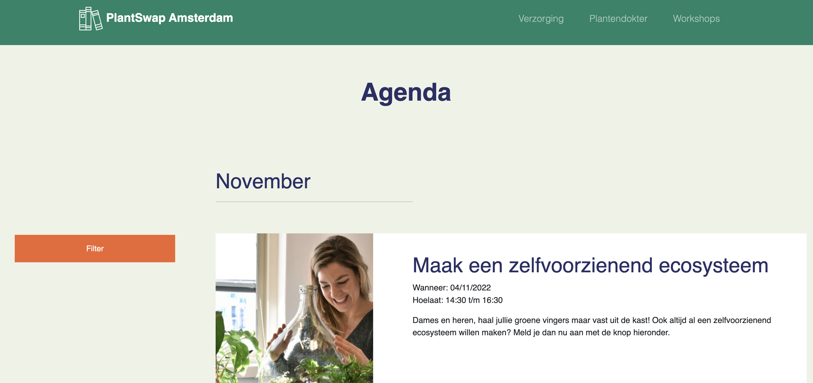
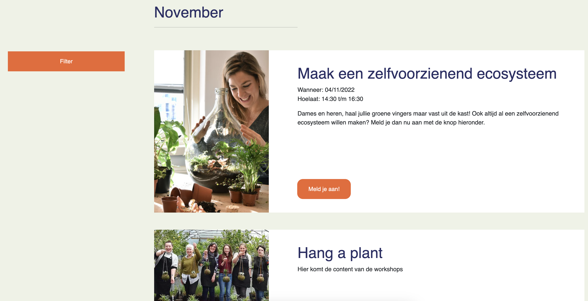
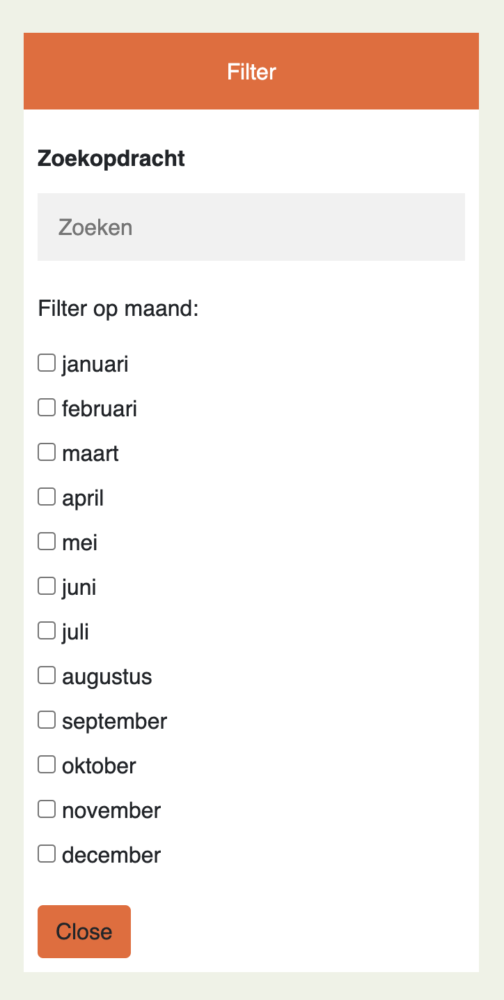
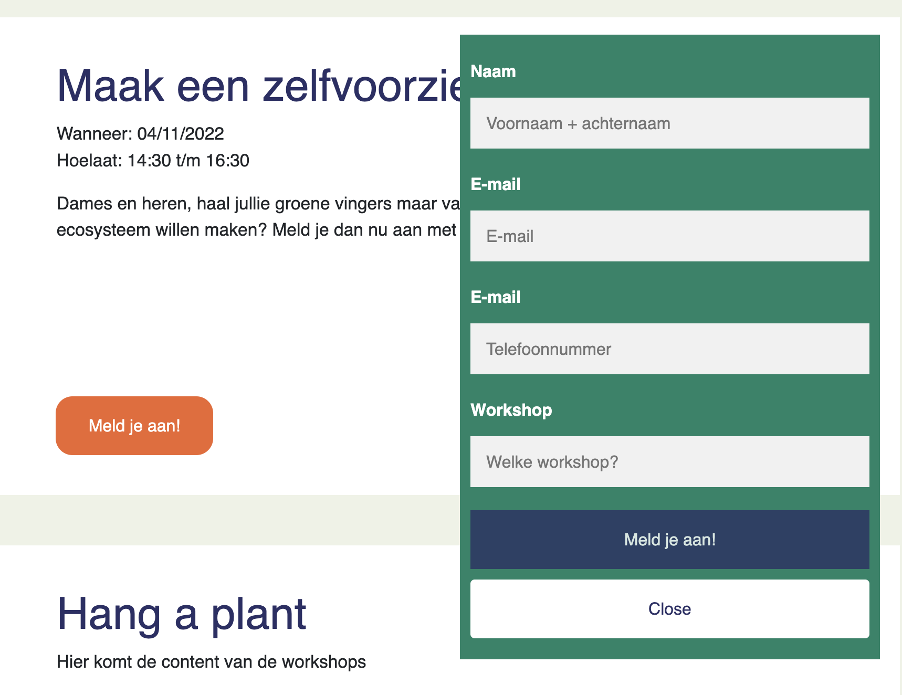

> _Fork_ deze leertaak en ga aan de slag. Onderstaande outline ga je gedurende deze taak in jouw eigen GitHub omgeving uitwerken. De instructie vind je, zoals altijd, in: [docs/INSTRUCTIONS.md](docs/INSTRUCTIONS.md)

# Titel
Accessibility, Buurtcampus Oost

## Inhoudsopgave

  * [Beschrijving](#beschrijving)
  * [Kenmerken](#kenmerken)
  * [Bronnen](#bronnen)
  * [Licentie](#licentie)

## Beschrijving
<!-- In de Beschrijving staat hoe je project er uit ziet, hoe het werkt en wat je er mee kan. -->
Deze sprint stond in thema van accessibility. Je leert hoe je een (gedeelte van een) website toegankelijk kan ontwerpen, bouwen en testen. Je ontwerpt en maakt voor een opdrachtgever een component/pagina/site toegankelijk volgens WCAG richtlijnen. De keuze was aan ons of de huidige user story verbeteren, of
een nieuwe te kiezen. Ik heb beide gedaan. De user story waar ik verder aan hebt gewerkt is: Als buurtbewoner van Amsterdam Oost wil ik zien wanneer er
een workshop is en hoe ik die kan bijwonen.

Op de workshop webpagina worden diverse workshops weergegeven per maand. Ook is er een filter menu, waar je kan filteren op maand. Of een Zoekopdracht
in kan dienen. Deze is op dit moment nog hardcoded. Bij elke workshop is er een button met: Meld je aan! Als er hierop geklikt word komt er een popup
formulier, waarbij je kan aanmelden voor de desbetreffende workshop.

<!-- Voeg een mooie poster visual toe 📸 -->

<!-- Voeg een link toe naar Github Pages 🌐-->
Mijn Github-pages:
https://github.com/joelle78/all-human-accessible-website

## Kenmerken
<!-- Bij Kenmerken staat welke technieken zijn gebruikt en hoe. Wat is de HTML structuur? Wat zijn de belangrijkste dingen in CSS? Wat is er met Javascript gedaan en hoe? Misschien heb je een framework of library gebruikt? -->
Op de feedback van vorige keer, heb ik dit keer geen framework gebruikt voor de layout van de workshop pagina. Dit keer heb ik gebruik gemaakt
van een grid-layout. Het filter en meld je aan formulier heb ik hetzelfde gerealiseerd als het reserveer een stekje form, op de homepage. Alleen bij het
formulier van filteren heb ik een position:absolute gebruikt. Zodat die niet mee beweegt bij de webpagina. Bij het andere formulier heb ik een position:fixed gebruikt. Zodat die wel meebeweegt met de webpagina.

Voor het testen van de accessibility van onze eigen en andere websites hebben we de tool lighthouse gebruikt. Lighthouse is een open source, geautomatiseerde tool voor het verbeteren van de prestatie, kwaliteit en correctheid van je web applicaties. Voor het testen van de kleurcontrasten
heb ik een andere tool gebruikt: contrast-ratio. Hier kan je 2 kleuren kiezen, en daar komt een contrast score uit. De test geeft aan of de kleurcontrasten
voldoende of onvoldoende zijn.

## Bronnen
https://joelle78.github.io/all-human-accessible-website/ 
https://www.buurtcampusoost.nl/s/  
https://chrome.google.com/webstore/detail/lighthouse/blipmdconlkpinefehnmjammfjpmpbjk?hl=nl  
https://www.a11yproject.com/checklist/  
https://contrast-ratio.com/#  
https://github.com/fdnd-agency  
https://getbootstrap.com/  
https://developer.mozilla.org/en-US/

## Licentie

This work is licensed under [GNU GPLv3](./LICENSE).
